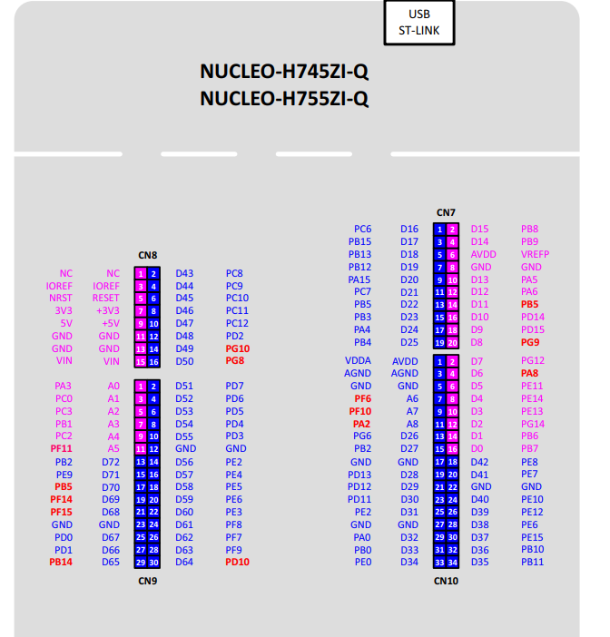

# NUCLEO-H755ZI-Q PPP Client

Zephyr PPP client for the STM32 Nucleo H755ZI-Q board. Establishes a point-to-point link over UART to a Linux host running `pppd`, then runs a UDP echo test.

## Hardware Setup

| Signal | STM32 Pin       | Morpho Connector |
|--------|-----------------|------------------|
| PPP TX | PD5 (USART2 TX) | CN9 pin 6        |
| PPP RX | PD6 (USART2 RX) | CN9 pin 4        |
| GND    | GND             | CN9 pin 12       |



Connect PD5/PD6 to a USB-to-UART adapter on the host PC. The ST-Link VCP (USART3) remains available for the Zephyr shell console at 115200 baud.

## Build & Flash

```bash
west build -b nucleo_h755zi_q/stm32h755xx/m7
west flash
```

## Host Side

### 1. Start pppd

```bash
sudo pppd /dev/ttyUSB0 115200 noauth local nodetach debug nocrtscts \
    192.168.1.1:192.168.1.2 nodefaultroute
```

This assigns:
- **192.168.1.1** to the host
- **192.168.1.2** to the Nucleo board (via IPCP)

### 2. Start the test server

```bash
cd server
python3 te.py
```

This starts:
- **UDP echo server** on port 7780 — echoes received packets back
- **UDP receive server** on port 7781 — validates packets against a PRNG sequence

## What Happens

1. Board boots, brings up the PPP interface on USART2
2. LCP/IPCP negotiation happens automatically with the host's `pppd`
3. Once the link is up (IP assigned), the board runs a UDP echo test against `192.168.1.1:7780`
4. Results are printed on the shell console
5. LED blinks to indicate the board is running

## Shell Commands

Available on the ST-Link VCP console (USART3, 115200 baud):

```
net iface        — show network interfaces
net ping <ip>    — ping a host (e.g. net ping 192.168.1.1)
net stats        — network statistics
help             — list all commands
```

## Project Structure

```
├── CMakeLists.txt
├── prj.conf                                          — Kconfig (PPP, networking, shell)
├── boards/
│   ├── nucleo_h755zi_q_stm32h755xx_m7.conf           — Board-specific Kconfig
│   └── nucleo_h755zi_q_stm32h755xx_m7.overlay        — DTS overlay (USART2 for PPP)
├── src/
│   └── main.c                                        — PPP client application
└── server/
    ├── te.py                                         — Host test server entry point
    ├── te_udp_echo.py                                — UDP echo server (port 7780)
    └── te_udp_receive.py                             — UDP receive/validate server (port 7781)
```
